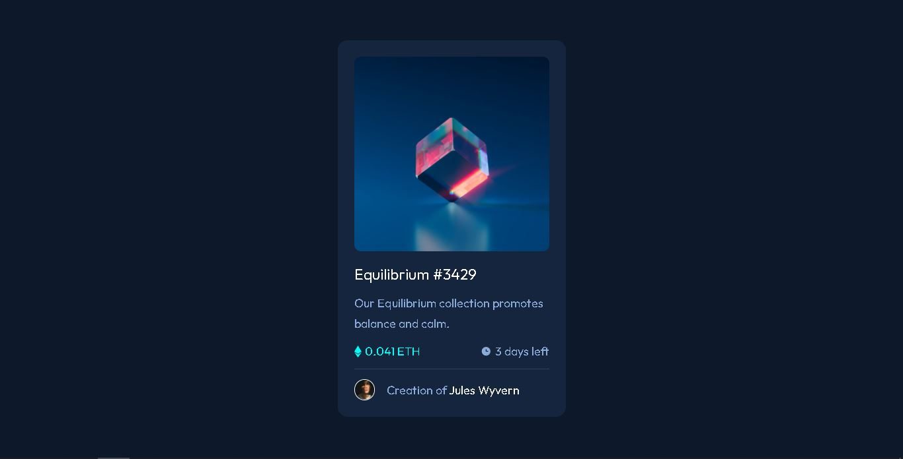

# Frontend Mentor - NFT preview card component solution

This is a solution to the [NFT preview card component challenge on Frontend Mentor](https://www.frontendmentor.io/challenges/nft-preview-card-component-SbdUL_w0U). Frontend Mentor challenges help you improve your coding skills by building realistic projects. 

## Table of contents

- [Overview](#overview)
  - [The challenge](#the-challenge)
  - [Screenshot](#screenshot)
  - [Links](#links)
- [My process](#my-process)
  - [Built with](#built-with)
- [Author](#author)

## Overview

### The challenge

Users should be able to:

- View the optimal layout for the interface depending on their device's screen size
- See hover and focus states for all interactive elements on the page

### Screenshot

  

## Links

- Solution URL: https://github.com/gutoPsilva/FrontEnd-Mentor/tree/main/003.%20nft-preview-card-component-main
- Live Site URL: https://gutopsilva.github.io/FrontEnd-Mentor/003.%20nft-preview-card-component-main/index.html

### Built with

- Semantic HTML5 markup
- CSS custom properties
- Flexbox
- Positioning
- Pseudoclasses

## Author

- GitHub - [gutoPsilva](https://github.com/gutoPsilva)
- Frontend Mentor - [@gutoPsilva](https://www.frontendmentor.io/profile/gutoPsilva)
- Twitter - [@nakeru78](https://www.twitter.com/nakeru78)
- LinkedIn - [Gustavo Pereira da Silva](https://www.linkedin.com/in/gustavo-pereira-da-silva-b5b684247/)
