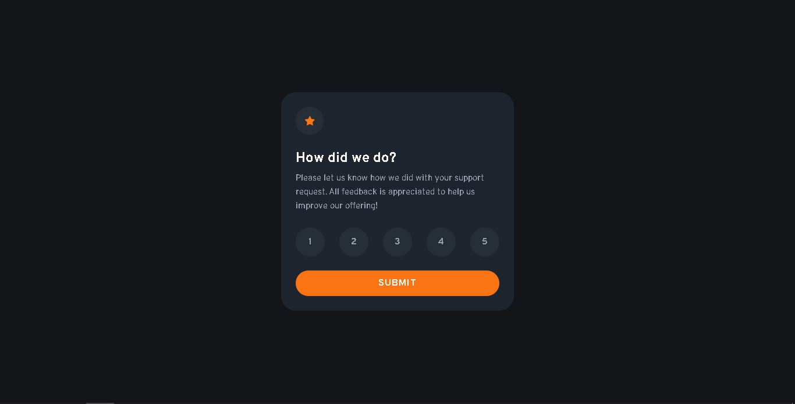
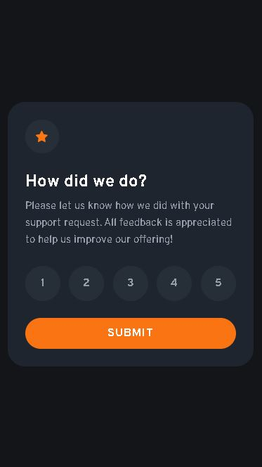

# Frontend Mentor - Interactive rating component solution

This is a solution to the [Interactive rating component challenge on Frontend Mentor](https://www.frontendmentor.io/challenges/interactive-rating-component-koxpeBUmI). Frontend Mentor challenges help you improve your coding skills by building realistic projects. 

## Table of contents

- [Overview](#overview)
  - [The challenge](#the-challenge)
  - [Screenshot](#screenshot)
  - [Links](#links)
- [My process](#my-process)
  - [Built with](#built-with)
- [Author](#author)

## Overview

### The challenge

Users should be able to:

- View the optimal layout for the app depending on their device's screen size
- See hover states for all interactive elements on the page
- Select and submit a number rating
- See the "Thank you" card state after submitting a rating

### Screenshot

  
  

### Links

- Solution URL: https://github.com/gutoPsilva/FrontEnd-Mentor/tree/main/004.%20interactive-rating-component-main
- Live Site URL: https://gutopsilva.github.io/FrontEnd-Mentor/004.%20interactive-rating-component-main/index.html

## My process

### Built with

- Semantic HTML5 markup
- CSS custom properties
- Flexbox
- Mobile-first workflow

## Author

- GitHub - [gutoPsilva](https://github.com/gutoPsilva)
- Frontend Mentor - [@gutoPsilva](https://www.frontendmentor.io/profile/gutoPsilva)
- Twitter - [@nakeru78](https://www.twitter.com/nakeru78)
- LinkedIn - [Gustavo Pereira da Silva](https://www.linkedin.com/in/gustavo-pereira-da-silva-b5b684247/)