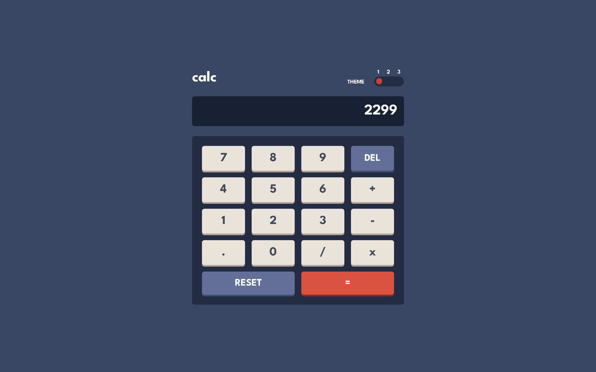
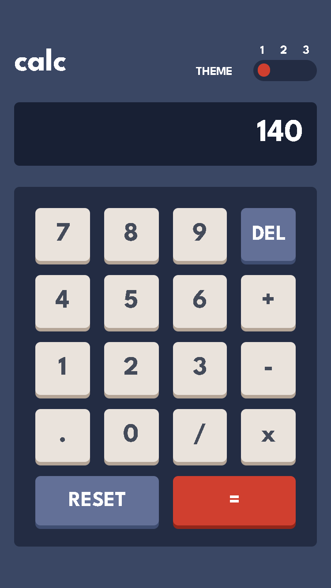
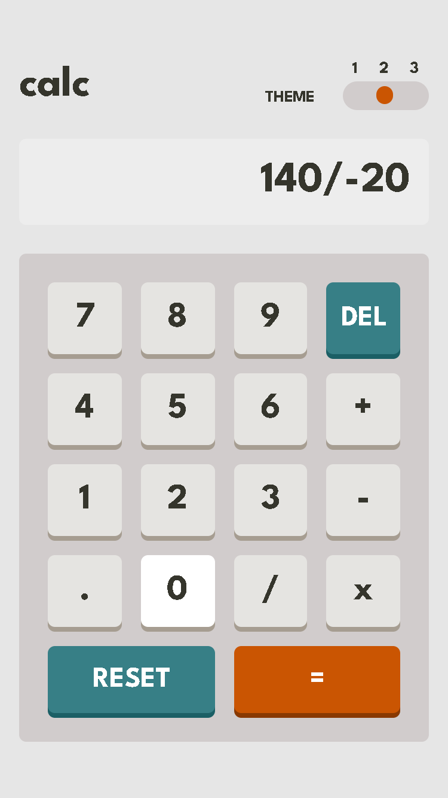
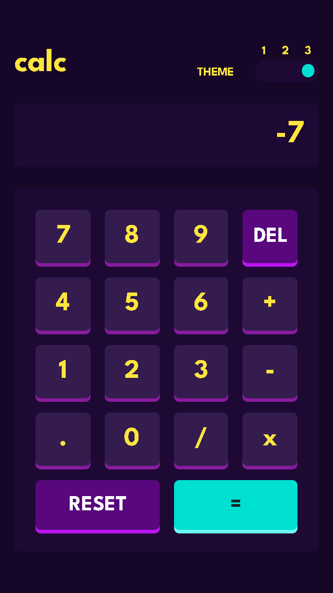

# Frontend Mentor - Calculator app solution

This is a solution to the [Calculator app challenge on Frontend Mentor](https://www.frontendmentor.io/challenges/calculator-app-9lteq5N29). Frontend Mentor challenges help you improve your coding skills by building realistic projects.

## Table of contents

- [Overview](#overview)
  - [The challenge](#the-challenge)
  - [Screenshot](#screenshot)
  - [Links](#links)
- [My process](#my-process)
  - [Built with](#built-with)
  - [What I learned](#what-i-learned)
  - [Continued development](#continued-development)
  - [Useful resources](#useful-resources)
- [Author](#author)

## Overview

### The challenge

Users should be able to:

- See the size of the elements adjust based on their device's screen size
- Perform mathmatical operations like addition, subtraction, multiplication, and division
- Adjust the color theme based on their preference
- **Bonus**: Have their initial theme preference checked and have any additional changes saved in the browser

EXTRA (i create it myself):
- The user can perform all mouse actions only with the keyboard, press "h" on the app for help!

### Screenshot

<div align="center">
  
  
  
  
</div>

### Links

- [Solution URL](#)
- [Live Site URL](https://gutopsilva-calculator-app.netlify.app/)

## My process

### Built with

<!-- Badges -->


- HTML5
- CSS3
- Git
- Mobile-first workflow
- [React](https://reactjs.org/) - JS Library
- [Typescript](https://www.typescriptlang.org/) - JavaScript Superset
- [Tailwind CSS](https://tailwindcss.com/) - CSS Framework
- [Google Fonts](https://fonts.google.com/) - Fonts Library
- [MathJS](https://mathjs.org/) - Math Library for JavaScript

### What I learned

ESLint popped me with the warning that the JavaScript eval function is dangerous and should be avoided, and because of that i discovered MathJS! I only imported and used the evaluate expression from MathJS, but now i know a new JS Library that might be useful in the future.

One thing i did to organize myself on theme switching was to set a theme object, and based on the properties of that object i would stylize all the elements of the App, for example, on the screen i had: 

``` html
<div className={`text-4xl rounded-md px-4 text-right py-4 ${tema.screen} ${tema["t-alt"]} overflow-y-hidden overflow-x-auto`}>
  {expression || 0}
</div>
```

The ```${tema.screen}``` and ```${tema["t-alt"]}``` will automatically change because it is based on a useState theme object, so when i change the object properties, all of those literals styling the elements would change too.

The two most difficult things to me were to handle the keyboard events & to avoid bad expressions made by the user. ChatGPT really helped me on those two things, with him i managed to build my own logic to avoid bad expressions, and even though the user somehow manages to construct a incorrect expression, the try-catch will avoid the app to crash and only display "Error" on the calc screen!

### Continued development

I decided to pick this project and build it with the latest technologies i learned, gotta say that completing this project is refreshing and i hope to keep evolving even on these skills. React & Tailwind is an amazing combo for web development!

### Useful resources

- [How to Customize Radio Buttons](https://www.w3schools.com/howto/howto_css_custom_checkbox.asp) - This and some of the resources below helped me a lot to build that theme switcher.
- [Radio Switcher CodePen](https://codepen.io/fredjens/pen/adqLNO) - This was the main source that helped me to build the switcher, i just adapted some of these ideas and transformed it with Tailwind CSS.
- [Make a div horizontally scrollable](https://www.geeksforgeeks.org/make-a-div-horizontally-scrollable-using-css/) - This helped me on the calc screen, i decided to not fix a limited expression length, so if the expression is bigger then the screen, it can just be scrolled!
- [How to Customize Horizontal Scrollbar](https://stackoverflow.com/questions/44334106/how-can-i-style-horizontal-scrollbar-by-css) - This was probably the thing that made me laugh at myself the most, i wasted like 20 minutes changing the scrollbar width, but not the height, and with horizontal scrollbars the thickness is dictated by the height. xD
- [Export Interfaces and Types in TS](https://bobbyhadz.com/blog/typescript-export-interface#:~:text=%23%20Export%20a%20Type%20in%20TypeScript,necessary%20in%20a%20single%20file.) - Typescript still makes me a fool, i have much to learn about it... 😅
- [ChatGPT](https://chat.openai.com/) - Helped me to implement useEffect to handle keyboard events.

## Author

- GitHub - [gutoPsilva](https://github.com/gutoPsilva)
- Frontend Mentor - [@gutoPsilva](https://www.frontendmentor.io/profile/gutoPsilva)
- LinkedIn - [Gustavo Pereira da Silva](https://www.linkedin.com/in/gustavo-pereira-da-silva-b5b684247/)
