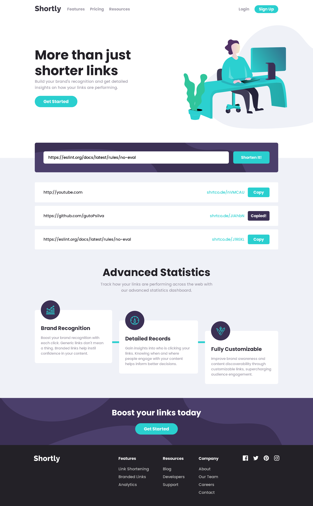

# Frontend Mentor - Shortly URL shortening API Challenge solution

This is a solution to the [Shortly URL shortening API Challenge challenge on Frontend Mentor](https://www.frontendmentor.io/challenges/url-shortening-api-landing-page-2ce3ob-G). Frontend Mentor challenges help you improve your coding skills by building realistic projects. 

## Table of contents

- [Overview](#overview)
  - [The challenge](#the-challenge)
  - [Screenshot](#screenshot)
  - [Links](#links)
- [My process](#my-process)
  - [Built with](#built-with)
  - [Continued development](#continued-development)
  - [Useful resources](#useful-resources)
- [Author](#author)

## Overview

### The challenge

Users should be able to:

- View the optimal layout for the site depending on their device's screen size
- Shorten any valid URL
- See a list of their shortened links, even after refreshing the browser
- Copy the shortened link to their clipboard in a single click
- Receive an error message when the `form` is submitted if:
  - The `input` field is empty

### Screenshot

  
  

### Links

- [Solution URL](#)
- [Live Site URL](https://shortly-gutopsilva.netlify.app/)

## My process

### Built with

<!-- Badges -->

- HTML5
- CSS3
- Git
- Mobile-first workflow
- [Vite](https://vitejs.dev/) - Front-end tool for optimized web applications.
- [React](https://reactjs.org/) - JS Library
- [React Icons](https://react-icons.github.io/react-icons/) - React Library for Icons
- [Typescript](https://www.typescriptlang.org/) - JavaScript Superset
- [Axios](https://axios-http.com/ptbr/) - HTTP Client to Fetch Data
- [Tailwind CSS](https://tailwindcss.com/) - CSS Framework
- [Styled Components](https://styled-components.com/) - React Library to Customize your Components
- [React Transition Group](https://reactcommunity.org/react-transition-group/) - Transition DOM Elements
- [Google Fonts](https://fonts.google.com/) - Fonts Library

### Continued development

I picked up this project to test my skills on React, Tailwind CSS, fetching data with AXIOS and for the first time trying to use Styled Components. The mix of Tailwind CSS & styled components makes any design system easily possibly to build on the web development.
Also gotta say that VITE is really faster than the default CRA way to develop.

### Useful resources

- [Copy Text to Clipboard](https://www.w3schools.com/howto/howto_js_copy_clipboard.asp) - Helped me to copy the generated short link into the user clipboard.
- [ChatGPT](https://chat.openai.com/) - Helped me on getting over with styled components and transitions.

## Author

- GitHub - [gutoPsilva](https://github.com/gutoPsilva)
- Frontend Mentor - [@gutoPsilva](https://www.frontendmentor.io/profile/gutoPsilva)
- LinkedIn - [Gustavo Pereira da Silva](https://www.linkedin.com/in/gustavo-pereira-da-silva-b5b684247/)
