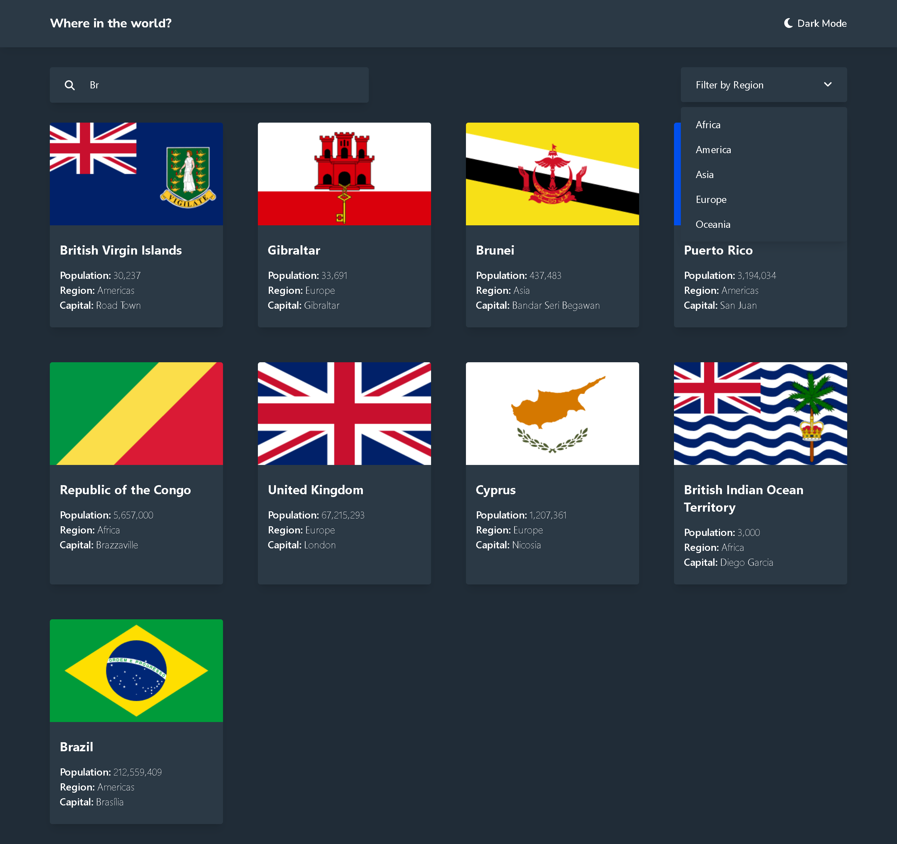
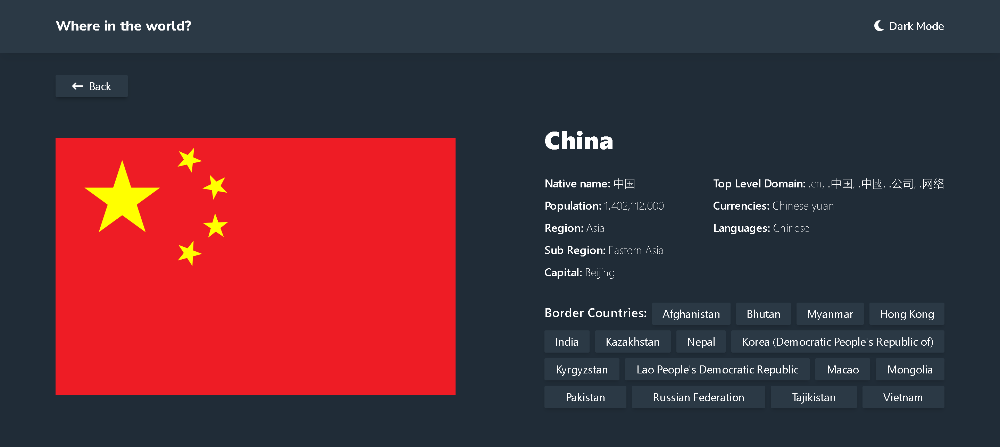

# Frontend Mentor - REST Countries API with color theme switcher solution

This is a solution to the [REST Countries API with color theme switcher challenge on Frontend Mentor](https://www.frontendmentor.io/challenges/rest-countries-api-with-color-theme-switcher-5cacc469fec04111f7b848ca). Frontend Mentor challenges help you improve your coding skills by building realistic projects. 

## Table of contents

- [Overview](#overview)
  - [The challenge](#the-challenge)
  - [Screenshot](#screenshot)
  - [Links](#links)
- [My process](#my-process)
  - [Built with](#built-with)
  - [Continued development](#continued-development)
  - [Useful Resources](#useful-resources)
- [Author](#author)

## Overview

### The challenge

Users should be able to:

- See all countries from the API on the homepage
- Search for a country using an `input` field
- Filter countries by region
- Click on a country to see more detailed information on a separate page
- Click through to the border countries on the detail page
- Toggle the color scheme between light and dark mode *(extra)*
- Be redirected to the country on Google Maps when clicking it's flag *(extra)*

OBS: A functionality this project proposed is to be redirected to the specific country page when clicking on any of the countries that are border of the current country. The latest version of the API(v3.1) returns only the short name of the countries, like SPA, FRA, RUS, etc. And using these names to fetch data from the API doesn't work, so what i did to get the full name of these borders was to use an older version (v2/alpha) because with these short names i can get the full name and make that functionality, HOWEVER, there are some countries with "bugged" names like 'Bolivia(Plurinational State of)' that doesn't exist on the new API.

OBS: There is also a small 'easter-egg' on this project, i bet you won't find it... (this was a literal hint for 404 .-. )

### Screenshot

OBS: Mobile screenshots were too long and weird to put here since .MD doesn't allow most styles, so check the mobile layouts on the live site or on the screenshots folder.

### Links

- [Solution URL](#)
- [Live Site URL](https://whereintheworld-gutopsilva.netlify.app/)

## My process

### Built with

<!-- Badges -->

- HTML5
- CSS3
- Git
- Mobile-first workflow
- [Angular](https://angular.io/) - TS Framework
- [RxJS](https://rxjs.dev/) - JS Library for asynchronous programs
- [Tailwind CSS](https://tailwindcss.com/) - CSS Framework
- [FontAwesome](https://fontawesome.com/) - Icons Libray
- [Google Fonts](https://fonts.google.com/) - Fonts Library

### Continued development

This is my first project using Angular and i have to say that the difference between this complete framework is gigantic compared to projects i used React, i think i'll stick with this one, it forces me to do "better coding" because of TypeScript and takes some time to structure my project, but every tools i need are easily obtainable and the project gets so well organized with this master piece called Angular!

### Useful resources

- [keyof typeof Object](https://bobbyhadz.com/blog/typescript-element-implicitly-has-any-type-expression#element-implicitly-has-an-any-type-because-expression-of-type-string-cant-be-used-to-index-type) - Helped me to get over with the error 'Element implicitly has an 'any' type because expression of type 'string' can't be used to index type', this piece of code is present at src/app/components/pages/countries/countries.component.ts
- [ChatGPT](https://chat.openai.com/) - Helped me on getting over with some animations and general Angular difficulties.

## Author

- GitHub - [gutoPsilva](https://github.com/gutoPsilva)
- Frontend Mentor - [@gutoPsilva](https://www.frontendmentor.io/profile/gutoPsilva)
- LinkedIn - [Gustavo Pereira da Silva](https://www.linkedin.com/in/gustavo-pereira-da-silva-b5b684247/)
