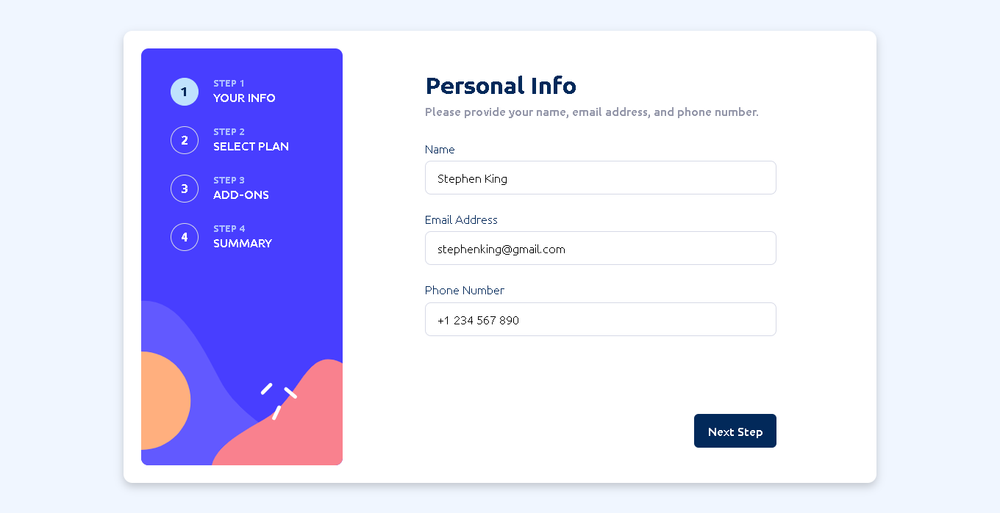
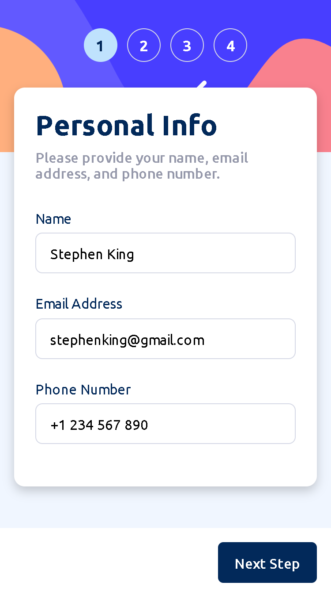

# Frontend Mentor - Multi-step form solution

This is a solution to the [Multi-step form challenge on Frontend Mentor](https://www.frontendmentor.io/challenges/multistep-form-YVAnSdqQBJ). Frontend Mentor challenges help you improve your coding skills by building realistic projects.

## Table of contents

- [Overview](#overview)
  - [The challenge](#the-challenge)
  - [Screenshot](#screenshot)
  - [Links](#links)
- [My process](#my-process)
  - [Built with](#built-with)
  - [Useful resources](#useful-resources)
- [Author](#author)

## Overview

### The challenge

Users should be able to:

- Complete each step of the sequence
- Go back to a previous step to update their selections
- See a summary of their selections on the final step and confirm their order
- View the optimal layout for the interface depending on their device's screen size
- See hover and focus states for all interactive elements on the page
- Receive form validation messages if:
  - A field has been missed
  - The email address is not formatted correctly
  - A step is submitted, but no selection has been made

### Screenshot

  
  

### Links

- [Solution URL](https://github.com/gutoPsilva/FrontEnd-Mentor/tree/main/021.%20multi-step-form-main)
- [Live Site URL](https://gutopsilva-multi-step-form.netlify.app/)

## My process

### Built with

<!-- Badges -->

- HTML5
- CSS3
- Git
- Mobile-first workflow
- [Netlify](https://www.netlify.com/) - Web Hosting
- [Angular](https://angular.dev/) - Front-end Framework
- [FontAwesome](https://fontawesome.com/) - Icons Libray
- [Google Fonts](https://fonts.google.com/) - Fonts Library

### Useful resources

- [Github Copilot](https://github.com/features/copilot) - I'm using this AI for every project i'm building.

## Author

- GitHub - [gutoPsilva](https://github.com/gutoPsilva)
- Frontend Mentor - [@gutoPsilva](https://www.frontendmentor.io/profile/gutoPsilva)
- LinkedIn - [Gustavo Pereira da Silva](https://www.linkedin.com/in/gustavo-pereira-da-silva-b5b684247/)
