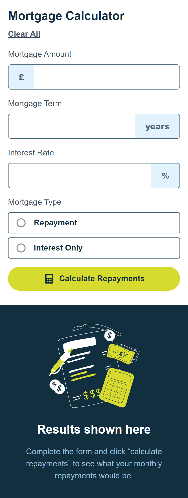
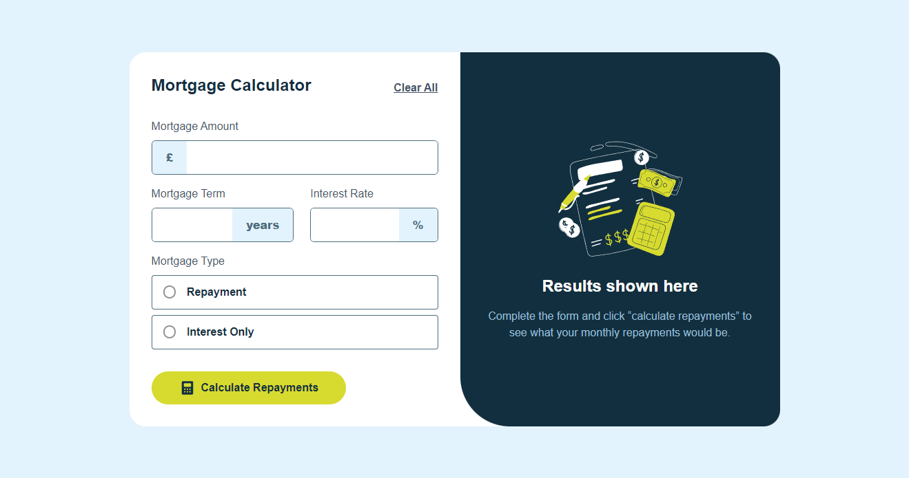

# Frontend Mentor - Mortgage repayment calculator solution

This is a solution to the [Mortgage repayment calculator challenge on Frontend Mentor](https://www.frontendmentor.io/challenges/mortgage-repayment-calculator-Galx1LXK73). Frontend Mentor challenges help you improve your coding skills by building realistic projects. 

## Table of contents

- [Overview](#overview)
  - [The challenge](#the-challenge)
  - [Screenshot](#screenshot)
  - [Links](#links)
- [My process](#my-process)
  - [Built with](#built-with)
  - [Continued development](#continued-development)
  - [Useful resources](#useful-resources)
- [Author](#author)

## Overview

### The challenge

Users should be able to:

- Input mortgage information and see monthly repayment and total repayment amounts after submitting the form
- See form validation messages if any field is incomplete
- Complete the form only using their keyboard
- View the optimal layout for the interface depending on their device's screen size
- See hover and focus states for all interactive elements on the page

### Screenshots

  
  

### Links

- [Solution URL](https://github.com/gutoPsilva/Frontend-Mentor/blob/main/024.%20mortgage-repayment-calculator-main/README.md)
- [Live Site URL](https://your-live-site-url.com)

## My process

### Built with

- HTML5
- CSS3
- Git
- Mobile-first workflow
- [NextJS](https://nextjs.org) - React Framework
- [Tailwind CSS](https://tailwindcss.com/) - CSS Framework
- [Google Fonts](https://fonts.google.com/) - Fonts Library

### Continued development

I decided to build this webpage using Next and TailwindCSS, mostly because i miss using TailwindCSS in projects and my React knowledge was getting rubbish, gotta say that i really don't miss React, not even with this framework. Personally i think that Angular is VERY better than React, even after some months of experience working deep on this IT market.

### Useful resources

- [Radio Buttons Styles Template](https://codepen.io/t_afif/pen/zYpLpGX) - This template from Temani Afif helped me to style the radio buttons as the design was supposed to be.

## Author

- GitHub - [gutoPsilva](https://github.com/gutoPsilva)
- Frontend Mentor - [@gutoPsilva](https://www.frontendmentor.io/profile/gutoPsilva)
- LinkedIn - [Gustavo Pereira da Silva](https://www.linkedin.com/in/gustavo-pereira-da-silva-b5b684247/)